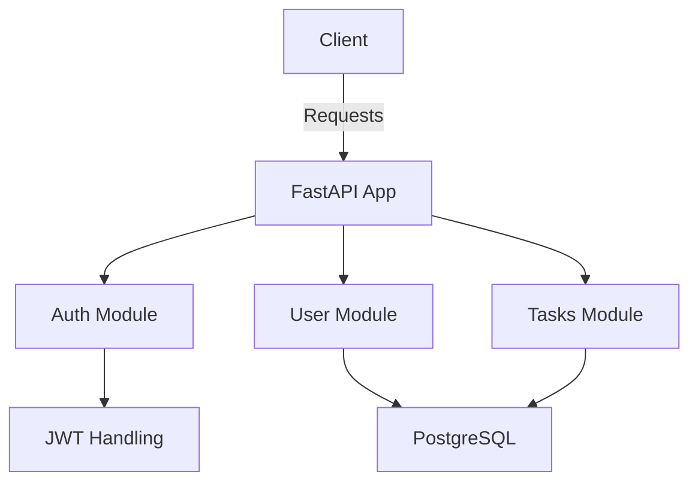

<a id="readme-top"></a>

# 🚀 Dodoes API

[![Contributors][contributors-shield]][contributors-url]
[![Forks][forks-shield]][forks-url]
[![Stargazers][stars-shield]][stars-url]
[![Issues][issues-shield]][issues-url]
[![Apache 2.0 License][license-shield]][license-url]

> **Dodoes API** is a secure and modular FastAPI backend for a lightweight decision-making platform.
> Built for clarity, flexibility, and performance – integrates JWT auth, PostgreSQL, and containerization.

---

## 📚 Table of Contents

1. [Installation](#installation)
2. [Environment Configuration](#environment-configuration)
3. [MoSCoW Analysis](#moscow-analysis)
4. [API Diagram](#api-diagram)
5. [CI Pipeline](#ci-pipeline)

---

## ⚙️ Installation <a name="installation"></a>

```bash
docker compose up --build
```

<p align="right">(<a href="#readme-top">back to top</a>)</p>

---

## 🔐 Environment Configuration <a name="environment-configuration"></a>

Create a `.env` file in the project root. Example content:

```env
LOG_LEVEL=INFO
LOG_FILENAME=app.log
LOG_FILEMODE=a

DATABASE_URL=postgresql://postgres:postgres@db:5432/dodoseapi

SECRET_KEY=8c91bd3bde6f787f82c245a5548e8e72f2f6faead21031f610a0984bd3ee8ca9
ALGORITHM=HS256
ACCESS_TOKEN_EXPIRE_MINUTES=30
```

<p align="right">(<a href="#readme-top">back to top</a>)</p>

---

## ✅ MoSCoW Analysis <a name="moscow-analysis"></a>

### 🔴 Must Have

* JWT-based user authentication
* User and task management endpoints
* PostgreSQL database integration
* Dockerized deployment (`docker-compose`)

### 🟠 Should Have

* Token expiration and refresh logic
* Role-based permission structure
* Basic logging and debugging via `.env`

### 🟢 Could Have

* OpenAPI documentation auto-generation
* Admin or monitoring dashboard
* Rate limiting

### 🔵 Won’t Have (for now)

* Frontend UI
* Social login (OAuth2)
* Multitenancy support

<p align="right">(<a href="#readme-top">back to top</a>)</p>

---

## 🗺️ API Diagram <a name="api-diagram"></a>



> More detailed documentation is available in the [Wiki](../../wiki).

<p align="right">(<a href="#readme-top">back to top</a>)</p>

---

## ⚙️ CI Pipeline <a name="ci-pipeline"></a>

The project uses **GitHub Actions** to ensure code quality and correctness across Python versions:

* ✅ Runs on push and PR to `master`
* 🧪 Supports Python `3.12` and `3.13`
* 🧼 Lints code with **Ruff**
* 🧪 Runs tests using **Pytest**

### `.github/workflows/ci.yml`:

```yaml
name: FastAPI CI

on:
  push:
    branches: ["master"]
  pull_request:
    branches: ["master"]

jobs:
  build:
    runs-on: ubuntu-latest
    env:
      SECRET_KEY: test-secret-key
      DATABASE_URL: sqlite:///./todosapp.db
    strategy:
      fail-fast: false
      max-parallel: 2
      matrix:
        python-version: [3.12, 3.13]

    steps:
    - name: Checkout code
      uses: actions/checkout@v4

    - name: Set up Python ${{ matrix.python-version }}
      uses: actions/setup-python@v4
      with:
        python-version: ${{ matrix.python-version }}

    - name: Cache pip
      uses: actions/cache@v4
      with:
        path: ~/.cache/pip
        key: ${{ runner.os }}-pip-${{ hashFiles('src/requirements.txt') }}
        restore-keys: |
          ${{ runner.os }}-pip-
          
    - name: Install dependencies
      run: |
        python -m pip install --upgrade pip
        pip install -r requirements.txt
        pip install pytest ruff

    - name: Lint with Ruff
      working-directory: src
      run: ruff check .

    - name: Run tests with Pytest
      run: pytest
```

<p align="right">(<a href="#readme-top">back to top</a>)</p>

---

<!-- Badges -->

[contributors-shield]: https://img.shields.io/github/contributors/Niewiaro/dodoes.svg?style=for-the-badge
[contributors-url]: https://github.com/Niewiaro/dodoes/graphs/contributors
[forks-shield]: https://img.shields.io/github/forks/Niewiaro/dodoes.svg?style=for-the-badge
[forks-url]: https://github.com/Niewiaro/dodoes/network/members
[stars-shield]: https://img.shields.io/github/stars/Niewiaro/dodoes.svg?style=for-the-badge
[stars-url]: https://github.com/Niewiaro/dodoes/stargazers
[issues-shield]: https://img.shields.io/github/issues/Niewiaro/dodoes.svg?style=for-the-badge
[issues-url]: https://github.com/Niewiaro/dodoes/issues
[license-shield]: https://img.shields.io/github/license/Niewiaro/dodoes.svg?style=for-the-badge&color=blue
[license-url]: https://github.com/Niewiaro/dodoes/blob/main/LICENSE
